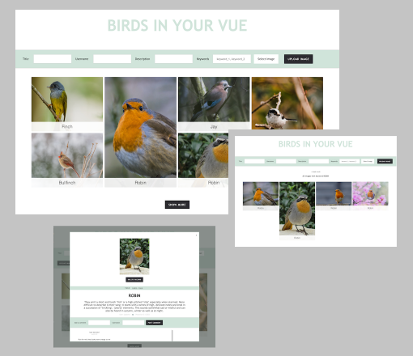

# imageboard

A personla project developed as SPA website using vue.js and Amazon S3.

The Imageboard allows anyone to post images of their choosing 

Features include: 
 
 - image upload
 - add a title and description and useful tags
 - delete images
 - comment on a selected image
 - sort images by tag

🐦 The theme of this imageboard is "Birds in your vue".

## Stack

     

## Development

To fork and work with this project follow these steps:

1. Clone the repository

    - `git clone git@github.com:vanpertsch/imageboard.git`

2. Go inside the directory

    - `cd imageboard`

3. Install dependencies

    - `npm install`

4. Start development server

    - `npm start`

## Preview

